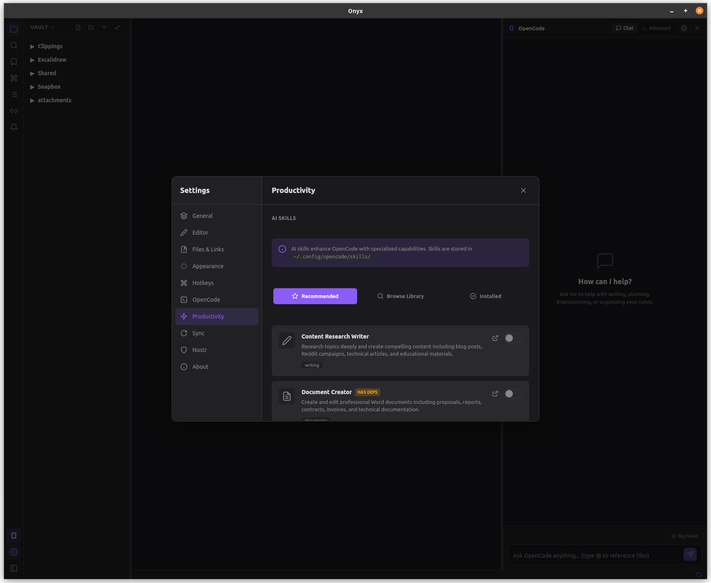
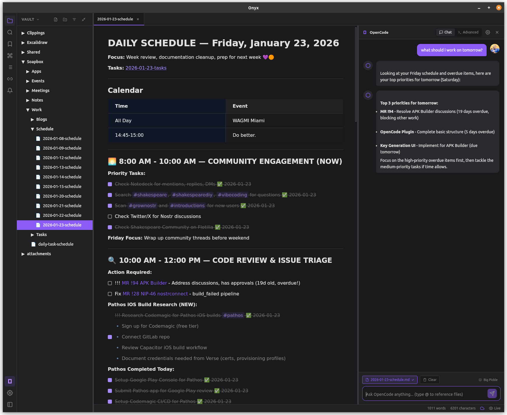

# Onyx

A private, encrypted note-taking app with Nostr sync.

Onyx lets you write markdown notes locally and sync them securely across devices using the Nostr protocol. Your notes are encrypted with your Nostr keys before being published to relays, ensuring only you can read them.




## Features

### Core
- **Markdown Editor** - Write notes with full markdown support and live preview
- **Local-First** - Your notes are stored locally as plain markdown files and work offline
- **Nostr Sync** - Encrypted sync across devices via Nostr relays
- **Secure Storage** - Private keys stored in your OS keyring (Keychain, libsecret, Credential Manager)
- **Cross-Platform** - Linux, macOS, and Windows

### Document Sharing
- **Share with Nostr Users** - Send encrypted documents to any Nostr user via npub, NIP-05, or hex pubkey
- **Notifications Panel** - See documents shared with you, with sender profiles and timestamps
- **Import Shared Docs** - Import received documents directly into your vault
- **Revoke Shares** - Remove shared documents you've sent to others

### Publishing
- **Publish as Articles** - Post markdown notes as NIP-23 long-form articles
- **Draft Support** - Publish as drafts (kind 30024) or published articles (kind 30023)
- **Auto-generated Tags** - Suggests hashtags based on document content

### Privacy & Security
- **End-to-End Encryption** - All synced content encrypted with NIP-44
- **Block Users** - Block bad actors using NIP-51 mute lists
- **Secure Previews** - XSS protection and URL sanitization for shared content
- **Private Mute Lists** - Blocked users stored encrypted so only you can see them

### File Management
- **File Info Dialog** - View local file details and Nostr sync status
- **NIP-19 Addresses** - See naddr identifiers for synced files
- **Sharing Status** - See who you've shared each file with

## Installation

### Pre-built Binaries

Download the latest release for your platform from the [Releases](https://github.com/derekross/onyx/releases) page.

#### macOS Installation

The app is not currently signed with an Apple Developer certificate, so macOS will show a warning that the app is "damaged" or from an "unidentified developer". To install:

**Option 1: Remove quarantine attribute (recommended)**

Open Terminal and run:
```bash
xattr -cr /Applications/Onyx.app
```

If you installed it elsewhere, replace `/Applications/Onyx.app` with the actual path.

**Option 2: Right-click to open**

1. Right-click (or Control+click) on Onyx.app
2. Select "Open" from the context menu
3. Click "Open" in the security dialog

After doing this once, the app will open normally.

### Build from Source

#### Prerequisites

- [Node.js](https://nodejs.org/) 18+
- [Rust](https://rustup.rs/) 1.77+
- Platform-specific dependencies (see below)

#### Linux (Debian/Ubuntu)

```bash
sudo apt install libwebkit2gtk-4.1-dev libappindicator3-dev librsvg2-dev patchelf libsecret-1-dev libssl-dev libdbus-1-dev
```

#### macOS

```bash
xcode-select --install
```

#### Windows

Install [Visual Studio Build Tools](https://visualstudio.microsoft.com/visual-cpp-build-tools/) with "Desktop development with C++".

#### Build

```bash
# Clone the repository
git clone https://github.com/derekross/onyx.git
cd onyx

# Install dependencies
npm install

# Run in development mode
npm run tauri dev

# Build for production
npm run tauri build
```

## Usage

### Getting Started

1. Open Onyx and create or open a vault (folder for your notes)
2. Create notes using the sidebar or `Ctrl+N`
3. Write in markdown - your notes auto-save

### Nostr Sync

1. Go to **Settings > Nostr**
2. Login with your nsec (private key) or generate new keys
3. Go to **Settings > Sync** and enable sync
4. Click **Sync Now** or use the sync icon in the status bar


Your notes are encrypted with NIP-44 before being published to relays. Only you can decrypt them with your private key.

### AI Assistant

The app includes an integrated AI chatbot for assistance with writing and editing.




### Sharing Documents

1. Right-click a file in the sidebar
2. Select **Nostr > Share with user...**
3. Enter recipient's npub, NIP-05 (user@domain.com), or hex pubkey
4. Click **Share** to send the encrypted document

The recipient will see it in their notifications panel and can import it to their vault.

### Blocking Users

If you receive unwanted shares, you can block users:

1. Open the shared document preview
2. Click **Block** in the footer
3. Confirm to add them to your NIP-51 mute list

Blocked users can be managed in **Settings > Nostr > Blocked Users**.

### Keyboard Shortcuts

| Action | Shortcut |
|--------|----------|
| Save | `Ctrl+S` |
| Quick Switcher | `Ctrl+O` |
| Search in Files | `Ctrl+Shift+F` |
| Toggle Terminal | `Ctrl+\`` |
| Command Palette | `Ctrl+Shift+P` |

## How Sync Works

Onyx uses custom Nostr event kinds for encrypted file sync:

| Kind | Purpose | Encryption |
|------|---------|------------|
| 30800 | File content | NIP-44 (self) |
| 30801 | Vault index | NIP-44 (self) |
| 30802 | Shared documents | NIP-44 (recipient) |
| 30023 | Published articles | None (public) |
| 30024 | Draft articles | None (public) |
| 10000 | Mute list | NIP-44 (self, optional) |

All synced content is encrypted using NIP-44 with a conversation key derived from your own public/private key pair. This means only you can decrypt your notes, and relays only see encrypted blobs.

Shared documents are encrypted to the recipient's public key, so only they can decrypt them.

## Tech Stack

- [Tauri 2.0](https://tauri.app/) - Rust-based desktop framework
- [SolidJS](https://www.solidjs.com/) - Reactive UI framework
- [CodeMirror 6](https://codemirror.net/) - Text editor
- [nostr-tools](https://github.com/nbd-wtf/nostr-tools) - Nostr protocol library

## License

MIT

## Contributing

Contributions are welcome! Please open an issue or submit a pull request.
